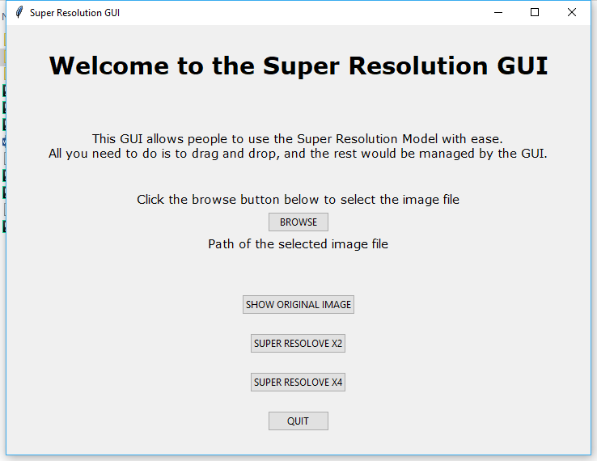

# Single Image Super Resolution (with GUI)

Image super resolution refers to the task of estimating a high-resolution image from its lower resolution version. In a more simple sense it requires us to generate pixel values for interpolating the given low resolution image to make it large. In this project I employ a deep learning approach to super resolve images to double or quadruple the original image. I used Keras with Tensorflow backend to implement the model in Python 3. The model I used is fairly simple and conists of layers of Convolutional and Deconvolutional with skip connections. A Mean Squared Error (MSE) loss is used to guide our model. I also designed a GUI with the model to make it to be used easily.

<p align="center">
  
</p>

The model is pre-trained with all weights included. So all you need to do is, clone this repository and run a python file. That's it.

## GUI

The GUI provides a easy-to-use Interface for super resolution. The GUI has 2 options for Super Resolution, either to double or to 
quadruple the original input image. It also comes with an option of saving the Super Resolved image.

<p align="center">
  
</p>

### Prerequisites

What things you need to install the software and how to install them

```
Give examples
```

### Installing

A step by step series of examples that tell you how to get a development env running

Say what the step will be

```
Give the example
```

And repeat

```
until finished
```

End with an example of getting some data out of the system or using it for a little demo

## Running the tests

Explain how to run the automated tests for this system

### Break down into end to end tests

Explain what these tests test and why

```
Give an example
```

### And coding style tests

Explain what these tests test and why

```
Give an example
```

## Deployment

Add additional notes about how to deploy this on a live system

## Built With

* [Dropwizard](http://www.dropwizard.io/1.0.2/docs/) - The web framework used
* [Maven](https://maven.apache.org/) - Dependency Management
* [ROME](https://rometools.github.io/rome/) - Used to generate RSS Feeds


## Authors

* **Billie Thompson** - *Initial work* - [PurpleBooth](https://github.com/PurpleBooth)

See also the list of [contributors](https://github.com/your/project/contributors) who participated in this project.

## License

This project is licensed under the GNU v3.0 License - see the [LICENSE.md](LICENSE.md) file for details

## Acknowledgments

* Hat tip to anyone whose code was used
* Inspiration
* etc
