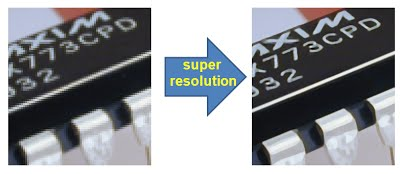
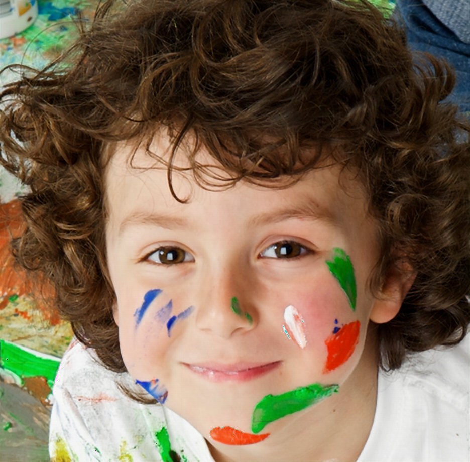
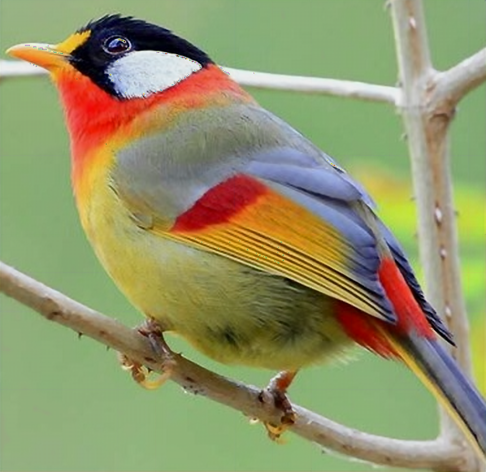
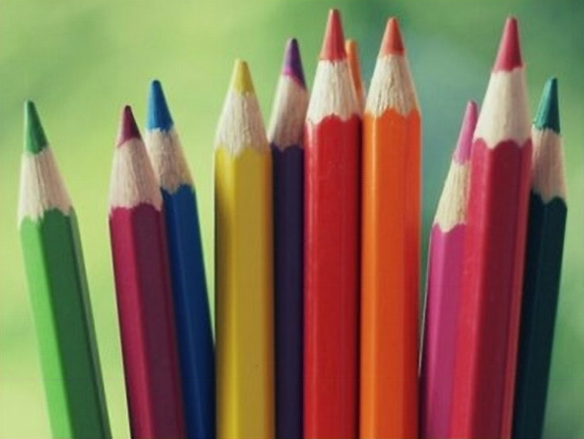

# Single Image Super Resolution (with GUI)

Image super resolution refers to the task of estimating a high-resolution image from its lower resolution version. In a more simple sense it requires us to generate pixel values for interpolating the given low resolution image to make it large. In this project I employ a deep learning approach to super resolve images to double or quadruple the original image. I used __Keras__ with _Tensorflow_ backend to implement the model in __Python 3__. The model I used is fairly simple and conists of layers of Convolutional and Deconvolutional with skip connections. A _Mean Squared Error (MSE)_ loss is used to guide our model. I also designed a __GUI__ with the model to make it to be used easily.

  

The model is pre-trained with all weights included. So all you need to do is, clone this repository and run the [sr_gui_browse.py](./sr_gui_browse.py). That's it.

## GUI

The GUI provides a easy-to-use Interface for super resolution. The GUI has 2 options for Super Resolution, either to double or to 
quadruple the original input image. It also comes with an option of saving the Super Resolved image.

  

### Files

This repository consists of all files used during the projects. Details of what each file does is given in the [Readme.docx](./Readme.docx) file. And even the code files are commented wherever necessary.

### Running the GUI

* Clone the repository.
* Install the dependencies from [requirements.txt](./requirements.txt).
* Run [sr_gui_browse.py](./sr_gui_browse.py) file.

## Examples

Some examples are shown below :

* **Example 1:** &nbsp; Original image (Left), &nbsp;&nbsp;&nbsp;&nbsp; x2 Image (Center), &nbsp;&nbsp;&nbsp;&nbsp; x4 Image (Right)

  
  
  

  

 
 

* **Example 2:** &nbsp; Original image (Left), &nbsp;&nbsp;&nbsp;&nbsp; x2 Image (Center), &nbsp;&nbsp;&nbsp;&nbsp; x4 Image (Right)

  
  
  

  

 
 

* **Example 3:** &nbsp; Original image (Left), &nbsp;&nbsp;&nbsp;&nbsp; x2 Image (Center), &nbsp;&nbsp;&nbsp;&nbsp; x4 Image (Right)

  
  
  

  

 
 

* **NOTE :** The size of images shown above are not actual, they are resized to fit document. See [SR_sample_images](./SR_sample_images) for the above images in actual size.

## License

This project is licensed under the GPL v3.0 License - see the [LICENSE.md](LICENSE.md) file for details

## Acknowledgments

* This was my project as an intern under [Prof. A. V. Subramanyam](https://www.iiitd.ac.in/subramanyam).
